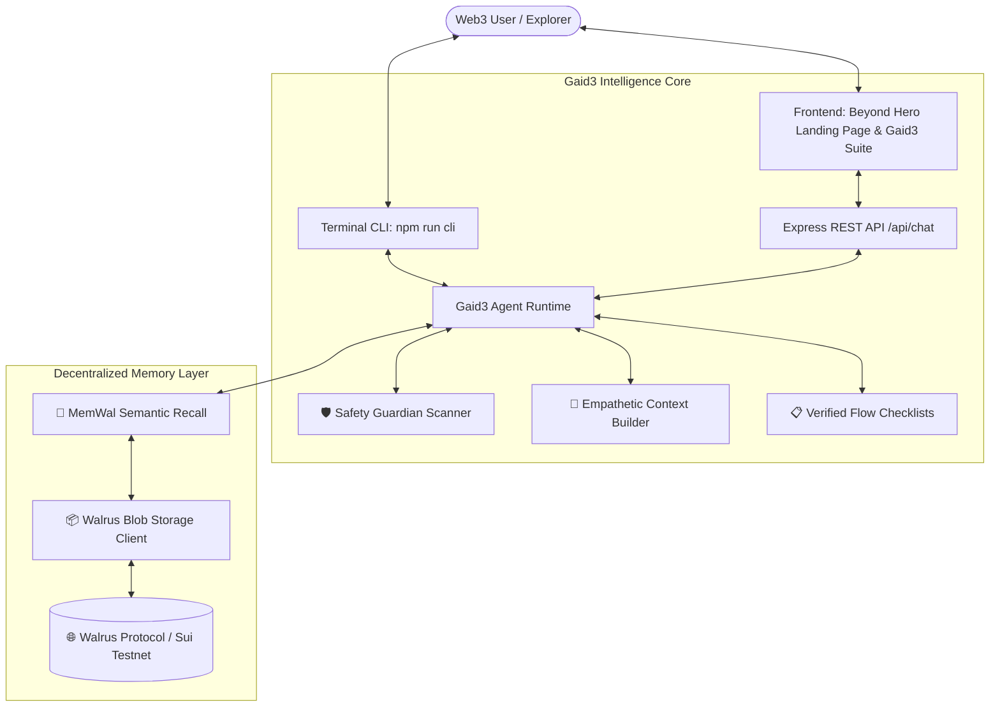

<div align="center">

# Gaid3 — Web3 Onboarding AI Agent 🧭
### *Calm, Patient, and Sovereign Web3 Onboarding Powered by Walrus Memory*

[](https://github.com/xi-kki/gaid3/actions)
[](LICENSE)
[](https://walrus.xyz)
[](https://sui.io)
[](https://www.typescriptlang.org/)
[](https://vercel.com)

<br/>

[](https://vercel.com/new/clone?repository-url=https%3A%2F%2Fgithub.com%2Fxi-kki%2Fgaid3)

<br/>


<p align="center">
  <b>Gaid3</b> eliminates crypto anxiety by pairing an empathetic AI onboarding companion with decentralized memory on <b>Walrus Protocol</b>.
</p>

</div>

---

## 🌟 Executive Summary & Problem Statement

Entering Web3 is notoriously terrifying for beginners. Confusing terminology, high-pressure irreversible transactions, malicious token approvals, and complex wallet setups cause catastrophic drops in onboarding conversion.

**Gaid3** solves this with a **stress-free, empathetic pair guide**:
- **Continuous Sovereign Memory**: Remembers your experience level, preferred chains, completed checklists, and past scary moments permanently across conversations using **Walrus Protocol** decentralized blobs.
- **Pre-Flight Safety Guardian**: Evaluates text, smart contract interactions, and approval allowances before you sign in your wallet.
- **Progressive Step-by-Step Guidance**: Breaks complex tasks (Sui Wallet creation, DEX swaps on Cetus/Turbos, bridging) into safe, bite-sized steps with mandatory pause checks on irreversible actions.

---

## 🏗️ System Architecture



---

## ⚡ Key Features

| Feature | Description |
| :--- | :--- |
| **🧠 Walrus Decentralized Memory** | Proactive semantic recall powered by MemWal. Stores user experience, risk tolerance, and checklists directly on Walrus decentralized storage. |
| **🛡️ Pre-Flight Safety Sandbox** | Scans for seed phrase leakage, unlimited contract spending approvals, phishing URLs, and gas exhaustion before signing. |
| **🎨 "Beyond Hero" Landing Page** | High-performance React + Vite + Tailwind frontend featuring 4-layer stacked `GAID3` typography, scroll-driven word animations, and infinite white marquee. |
| **📋 Verified Step-by-Step Flows** | Interactive onboarding guides for Sui Wallet setup, seed phrase paper backup, and Cetus/Turbos safe swapping. |
| **💻 Interactive Terminal CLI** | Full-featured CLI (`npm run cli`) with `/memory`, `/safety`, and `/sync` commands for developers. |
| **🔒 Enterprise Security Posture** | Comprehensive `SECURITY.md`, zero-key leakage architecture, and automated GitHub Actions CI/CD pipeline. |

---

## 🚀 Live Deployment Options

### Option 1: One-Click Automatic Vercel Deployment
Click the button below to deploy your own instance of Gaid3 to Vercel instantly:

[](https://vercel.com/new/clone?repository-url=https%3A%2F%2Fgithub.com%2Fxi-kki%2Fgaid3)

*(The included [`vercel.json`](vercel.json) automatically configures the Vite frontend build and routing).*

---

### Option 2: Deploying via Vercel Dashboard (Connected to GitHub)
1. Go to [vercel.com](https://vercel.com) and log in with your GitHub account.
2. Click **"Add New..."** $\rightarrow$ **"Project"**.
3. Select the **`xi-kki/gaid3`** repository.
4. Keep the default settings (Vercel automatically detects Vite and `vercel.json`).
5. Click **"Deploy"**!

---

### Option 3: Local Development Quickstart

```bash
# 1. Clone the repository
git clone https://github.com/xi-kki/gaid3.git
cd gaid3

# 2. Install dependencies & compile
npm install
cd web && npm install && cd ..
npm run build

# 3. Launch interactive CLI
npm run cli

# 4. Launch the Web Landing Page & Gaid3 Suite
npm run web:dev
```
Open **`http://localhost:3000`** in your browser.

---

## 🛡️ Security & Privacy Guarantees

- **No Key Custody**: Gaid3 never stores, requests, or transmits private keys or seed phrases.
- **Automated CI/CD**: Every push is verified with TypeScript strict compilation and automated dependency security scans.
- See full security details in [`SECURITY.md`](SECURITY.md).

---

## 📜 License
Distributed under the **Apache License 2.0**. See [`LICENSE`](LICENSE) for more information.
